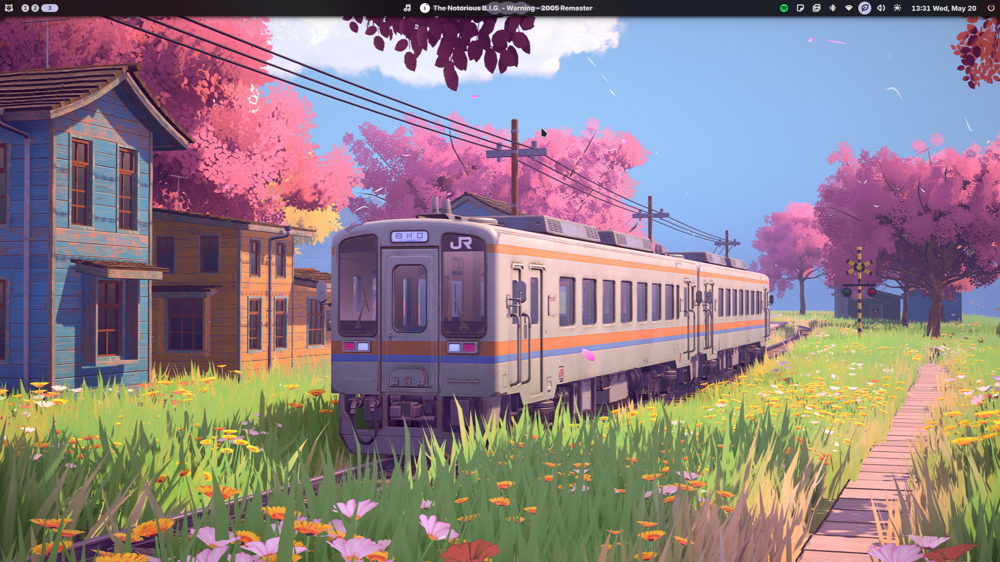

## Installation

Installing Linux on my Dell Latitude 7490 was not straightforward. The laptop would freeze at startup, which made the process frustrating at the very begging.

After some research, I came across a website [H'S Blog](https://b2g.h11e.de/2021/09/dell7490/)that had the exact fix i needed.
It explained that running a modern Linux distro on my Dell 7490 requires adding two kernel options: `i915.enable_dc=0` and `intel_idle.max_cstate=1`. Without these, the system is unstable and freezes on startup.

I installed Arch Linux, and after the first boot I had to add those kernel options directly to my **Limine bootloader** config:

```config
//add at the end of cmdline(on all the kernels) in /boot/limine/limine.conf 
cmdline: ...i915.enable_dc=0 intel_idle.max_cstate=1
```

## Desktop Environment

My first desktop environment was **KDE Plasma**, which I used for about a month. However, I eventually found it too bloated for my taste, and it didn't offer the level of detailed customization I was looking for.

I then switched to **Hyprland**, but quickly realized it demanded a lot of ongoing attention and configuration to keep working the way I wanted.

After that, I moved to **Niri** with the **Noctalia shell**, and it turned out to be exactly what I was looking for.



Currently, I'm learning **Quickshell** so I can build my shell exactly the way I want it to look and behave.